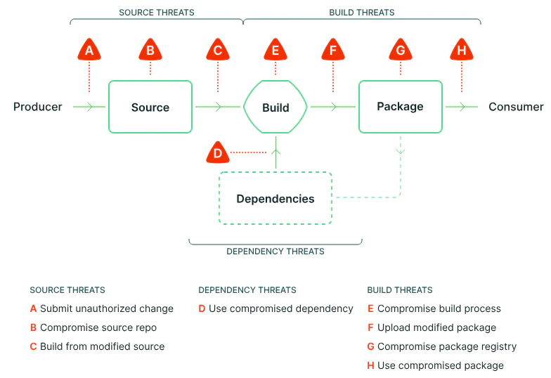

# Secure Software Supply Chains in the Age of AI

## The New Frontier of Software Supply Chain Security

The integration of artificial intelligence (AI) into the software development process seeks to revolutionize the industry. Companies like OpenAI and Meta claim that it will replace software developers in the not too distant future. Other companies are heavily investing in AI-assisted development, pairing a human developer and an AI assistant. 

This integration, particularly through large language models (LLMs), introduces new complexities and vulnerabilities into the software supply chain. Frameworks like [SLSA (Supply-chain Levels for Software Artifacts)](https://slsa.dev/) have emerged as critical tools for ensuring supply chain integrity even before the integration of AI. Using SLSA, we can
begin to understand the risks that AI-assisted software development presents to 
secure software supply chains and ways to keep them secure.

## Anatomy of a Modern Software Supply Chain

Modern software development pipelines consist of interconnected components such as source repositories, CI/CD systems, and dependency package managers. Each of these is a potential attack vector:

- **Source Repositories**: Vulnerable to unauthorized access or poisoned commits.
- **CI/CD Pipelines**: Susceptible to malicious code injection or configuration manipulation.
- **External Dependencies**: Adds risks like hallucinated dependencies or insecure model outputs

Software supply chain threats (Source: SLSA)

LLMs have enabled rapid prototyping and code generation. Developers can now produce functional code snippets in seconds, accelerating the generation of code. However, this acceleration comes with risks in the form of possibly insecure or malicious AI generated
code.

## Injection Vectors

### Source Code Contamination

[Prompt injection attacks](https://genai.owasp.org/llmrisk/llm01-prompt-injection/) can manipulate LLMs to generate insecure code patterns like SQL injection (SQLi) or cross-site scripting (XSS). With the rise of agentic AI-assisted workflows that inject web content into the context as part of the prompt, typically in the form of API documentation, an attacker could manipulate the contents of the code generated by an LLM. 

These types of attacks can also come from an [LLM model that has been trained to generate this type of code](https://blog.sshh.io/p/how-to-backdoor-large-language-models).

### Dependency Poisoning Pathways

LLMs may suggest non-existent or compromised libraries, leading to dependency confusion or [typosquatting](https://snyk.io/blog/typosquatting-attacks/) attacks. While these type of attacks can
happen with human generated code, "rubber stamping" of AI generated
code can amplify this issue.

### Client-Side Script Hijacking

Generated HTML/JavaScript code can include [malicious script tags](https://blog.sshh.io/p/how-to-backdoor-large-language-models) or bypass Content Security Policies (CSP), making client-side applications vulnerable.

## Mitigating the risks

In order for AI-assisted software development to fully benefit your company, you need to mitigate the risks that AI-generated code poses.

Agentic workflows allow the AI-assistant to run code, typically in the form of a test suite or a web server, on a developer's machine. To enhance security, implementing [devcontainers](https://github.com/mikegehard/ai-assisted-agile-development/blob/main/playbooks/ai-generated-code-execution.md) provides an effective isolation layer for executing AI-generated code.

The most critical defense against insecure code remains the human component of the AI-assisted pair. Thorough review of AI-generated code serves as an essential first step in maintaining software supply chain security while preserving a rapid feedback loop. Additionally, incorporating security scanning tools into your software supply chain can provide another layer of protection, though this may extend the feedback cycle when securing your codebase.

## Conclusion: Balancing Innovation and Integrity

The rise of AI-assisted development brings both unprecedented opportunities and significant risks to software supply chains. By adopting frameworks like SLSA and implementing secure practices tailored for AI contexts, organizations can strike a balance between innovation and integrity. However, human oversight remains indispensable in mitigating risks introduced by generative coding tools.

The call to action is clear: embrace structured frameworks like SLSA as foundational infrastructure for securing the future of software development in an AI-driven world.
